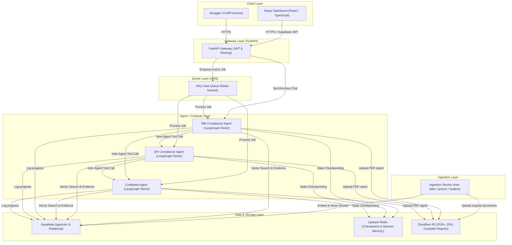
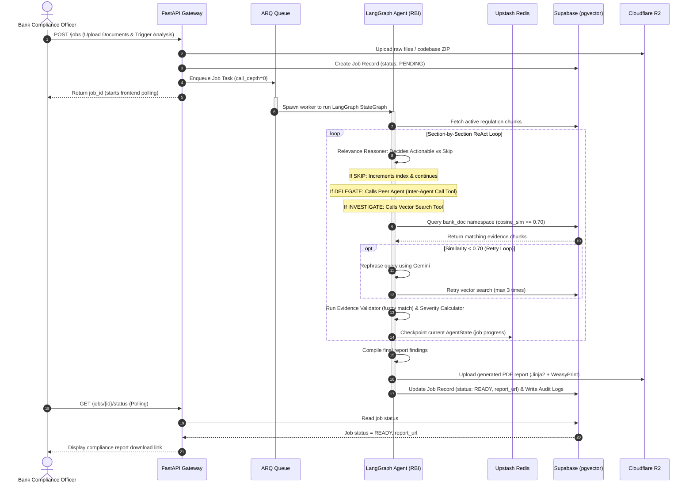

# BankGuard — Technical Interview Playbook

This document is your personalized preparation guide for the BankGuard technical interview. It provides comprehensive, highly detailed, and strategically phrased answers to key architectural, RAG, agentic, infrastructural, and high-pressure system design questions.

---

## 1. Core Platform Pitch & Key Talking Points

When asked to describe **BankGuard** or your role, here is your high-level overview:
- **What is it?** A multi-agent compliance platform that audits bank documents, API specifications, and codebases against regulatory frameworks (e.g., RBI Guidelines) using **LangGraph** explicit StateGraphs.
- **The Core Innovation (ReAct vs. standard RAG)**: Traditional RAG relies on simple vector similarity queries, which fail for complex regulatory audits. BankGuard implements a **ReAct reasoning loop** inside an explicit Python StateGraph. It reasons section-by-section through a regulation, checks evidence quality, runs fuzzy match verification on citations, and performs deterministic severity scoring.
- **Agent Collaboration**: A multi-agent hierarchy consisting of three domain-specialized agents:
  1. **RBI Compliance Agent**: General policies & high-level compliance.
  2. **API Compliance Agent**: Audits OpenAPI specifications.
  3. **Codebase Agent**: Terminal agent inspecting source code using AST/tree-sitter.

---

## 2. Technical Interview Questions & High-Impact Answers

---

### Category A: Architecture & Design

#### Q1: Walk me through the overall architecture of BankGuard.

BankGuard uses a highly modular, decoupled multi-service architecture designed to handle long-running, CPU-heavy regulatory analysis while remaining cost-effective, scalable, and resilient. Below is the system architecture diagram and the end-to-end processing data flow:

### 1. System Architecture Diagram

### 2. Component Layout
* **Gateway Layer (FastAPI)**: Serves as the single secure entry point. It validates Supabase JWTs, enforces rate limits, creates job metadata records in Supabase, and enqueues worker tasks on the ARQ queue (setting initial state parameter `call_depth=0`).
* **Agent/Compute Layer (Render Services)**: Three isolated microservices deployed as Docker containers running the LangGraph ReAct StateGraph. 
* **Ingestion Layer**: A dedicated microservice hosting processing utilities—including tree-sitter AST parsers for code isolation, `prance` for OpenAPI `$ref` dereferencing, and PDF loaders. Chunks are embedded using `text-embedding-004` and written to Supabase vector stores.
* **Data & Caching Layer**:
  * *Supabase (pgvector)*: Houses relational metadata (job tracking, predefined questions, audit logs) and 768-dimensional embeddings separated by dual namespaces.
  * *Upstash Redis*: Provides sub-millisecond serverless key-value lookups for LangGraph's node checkpointing and transient chat sessions (with a 30-minute TTL).
  * *Cloudflare R2*: Store for raw ingested files, codebase archives, and WeasyPrint-compiled PDF reports.

### 3. End-to-End Data Flow Sequence

---

---

#### Q2: Why did you choose a peer-to-peer agent design instead of a master orchestrator pattern?
* **Decoupled Scaling & Extensibility**: In a master orchestrator pattern, adding a new domain agent (e.g., a "Cybersecurity Agent" or a "Cloud Infrastructure Agent" in V2) requires modifying the orchestrator's routing logic, prompt templates, and state schema. Under our P2P design, adding a new agent requires zero changes to existing agents. We simply register the new service in the Gateway and register it as an available tool in the peer agents.
* **Fault Isolation & Graceful Degradation**: If a master orchestrator goes down, the entire system is paralyzed. If the Codebase Agent goes down in our P2P architecture, the RBI Compliance Agent continues auditing policies and gracefully degrades delegation steps, logging a `partial delegation failure` in the audit logs while completing the rest of the report.
* **Domain Ownership**: P2P allows each agent to encapsulate its tools and schema perfectly. The Codebase Agent operates on code AST chunks; the RBI Agent operates on text PDFs. They communicate strictly via the clean `call_agent` tool interface.

---

#### Q3: What is LangGraph and why did you use it over a simpler chaining approach like LangChain LCEL?
* **Cyclic Graph Support**: Simple chains (LCEL) are strictly linear, directed acyclic graphs (DAGs). Regulatory auditing is fundamentally cyclic—requiring loops (e.g., the ReAct loop, iterating section-by-section, or query-rephrasing retry loops when similarity falls below 0.70). LangGraph allows defining complex cycles cleanly in Python.
* **State Checkpointing & Resiliency**: LangGraph serializes the entire state object (`AgentState`) at every node transition and saves it to a persistent checkpoint database (Upstash Redis). If a long-running background analysis job (which takes 5–20 minutes) is interrupted due to network loss or worker restart, the worker can resume execution from the exact node and regulation chunk where it failed, rather than starting the costly audit from scratch.
* **Auditability & Traceability**: Each node and transition is explicitly defined in Python (`StateGraph`). This makes the system deterministic, easily visualizable, and highly auditable—critical for a bank where compliance teams demand to see the step-by-step reasoning chain that led to a "critical gap" finding.

---

#### Q4: You have three agents — how do they decide when to delegate to each other?
* **Conditional Routing in Relevance Reasoner**: Each agent runs a `Relevance Reasoner` decision node. When iterating over a regulation chunk, the agent uses Gemini 1.5 Pro to evaluate the chunk's content:
  * If the chunk touches API interfaces, endpoint parameters, OpenAPI definitions, or REST standards, it routes to the `DELEGATE` edge, triggering the `call_agent` tool targeting the **API Compliance Agent**.
  * If the chunk touches source-code implementation (e.g., hardcoded credentials, cryptographic library usage, file write buffers), it routes to the `DELEGATE` edge, triggering the `call_agent` tool targeting the **Codebase Agent**.
  * If it is a generic policy mandate, it routes to the `INVESTIGATE` edge and calls its own local vector search.

---

#### Q5: What happens if two agents disagree on a compliance verdict?
* **No Direct Conflict (Multi-Layered Context)**: The agents don't compete on the *same* document; they audit different layers of the compliance stack. Therefore, they don't disagree; they complement each other.
  * The **Compliance Agent** audits the *written policy* (e.g., "Policy says we enforce AES-256 for database encryption" $\rightarrow$ Compliant).
  * The **Codebase Agent** audits the *implementation* (e.g., "Code in database_client.py uses plain text" $\rightarrow$ Gap).
* **Final Compiled Synthesis**: Both findings are included in the final compiled report, clearly attributed to their respective agents (e.g., *"Policy: Compliant (RBI Compliance Agent) | Codebase: Non-Compliant (Codebase Agent)"*). This provides the compliance officer with a comprehensive gap analysis showing that while the policy is correct, the implementation has failed.

---

### Category B: RAG & Retrieval

#### Q6: How did you chunk the RBI regulatory PDFs — what strategy and why?
* **Regulatory PDFs**: Processed using `RecursiveCharacterTextSplitter` with a chunk size of `800 tokens` and an overlap of `100 tokens`. Regulatory clauses are dense and multi-layered; a smaller window (e.g., 200 tokens) would chop a single complex clause into fragmented pieces, while a larger window (e.g., 2000 tokens) dilutes the embedding vector, leading to poor semantic retrieval.
* **OpenAPI Specs**: Parsed using `prance` to resolve `$ref` schemas, flattening the spec. Each endpoint path is treated as an isolated chunk, tagged with metadata (`endpoint_path`), ensuring the embedding model captures the API interface contract cleanly.
* **Codebase Repository**: Parsed using `tree-sitter` to extract syntactic code structures (classes, functions, methods) as discrete chunks, rather than raw text split windows. This ensures a chunk contains a complete, executable unit of code (along with line numbers and file paths), preserving logical boundaries.

---

#### Q7: Why did you set the similarity threshold at 0.70 specifically?
* **Empirical Validation**: During system calibration, we tested cosine similarity scores of `text-embedding-004` on a golden dataset of compliance queries.
  * Scores **$\ge$ 0.70** represent highly relevant, semantically aligned bank document chunks containing valid matching policy statements or implementation logic.
  * Scores **< 0.70** represent noisy, weakly related, or entirely irrelevant matches.
* Setting a strict **0.70 threshold** acts as an automated filter. If the best retrieved chunk has a score below 0.70, it is flagged as a potential gap (the bank has no document addressing the regulation) rather than allowing the LLM to hallucinate compliance based on loosely matched documents.

---

#### Q8: What is dual namespace retrieval and what problem does it solve here?
* **The Problem**: A single, global vector space causes "cross-contamination." If we search a query across regulations and bank policies simultaneously, the regulation text chunks will dominate the results, crowding out the actual bank policy evidence.
* **The Solution**: Every agent operates on two distinct pgvector namespaces:
  1. `"{agent_domain}_regulation"` (the source of truth regulatory rules).
  2. `"{agent_domain}_bank_doc"` (the bank's internal files, Specs, or Code).
* During an audit, the agent retrieves the active regulation chunks from the regulation namespace sequentially. For each actionable chunk, it executes a vector search targeting *only* the `bank_doc` namespace. This keeps the "criteria" and "evidence" logically isolated, resulting in precise gap-matching.

---

#### Q9: How do you handle a query that falls below the similarity threshold — what does the system do?
* **Rephrase & Retry Loop**: When a vector search against the bank doc namespace returns a maximum similarity score of less than 0.70:
  1. The agent increments a `retry_count` (stored in the LangGraph state).
  2. The query is sent to Gemini to be rephrased, converting dry legal/regulatory phrasing into developer-centric or operational synonyms (e.g., rephrasing "implement cryptographic safeguards for authentication credentials" to "retrieve database connection string passwords or bcrypt hashing").
  3. The vector search is re-executed with the rephrased query.
* **Graceful Fallback**: If after **3 retries** the maximum similarity remains below 0.70, the search is abandoned, the section is flagged as "insufficient evidence / non-compliant", and the agent moves to the next regulation chunk without hallucinating.

---

#### Q10: How did you evaluate retrieval quality — what metrics did you use?
We measured retrieval performance using three key metrics from standard RAG evaluation:
1. **Context Recall**: Did we retrieve all relevant regulatory rules and bank evidence? We validated this by comparing retrieved chunks to a human-annotated set of target chunks.
2. **Context Precision**: Out of all retrieved chunks, what percentage were actually relevant? We aimed to keep this close to 1.0 using our similarity threshold.
3. **Faithfulness / Grounding**: We measured whether the final gap assessment generated by Gemini cited ONLY facts present in the retrieved chunks. We validated this programmatically using our **Evidence Validator tool**, which fuzzy-matches generated citations against pgvector.

---

### Category C: Agents & ReAct

#### Q11: Explain the ReAct loop in your own words and how it plays out in BankGuard.
* **ReAct (Reason + Act)** is an agent framework where the LLM undergoes a step-by-step cycle of: **Thought $\rightarrow$ Action $\rightarrow$ Observation $\rightarrow$ Thought**. Instead of generating an answer in a single shot, the LLM writes its reasoning first, decides to execute an action (e.g., calling a tool), receives the result, and reasons again.
* **In BankGuard**:
  * **Thought**: *"I am auditing RBI Circular 3.2 on multi-factor authentication. I need to see if the bank policy covers this."*
  * **Action**: Calls `search(query="multi factor authentication", namespace="rbi_bank_doc")`.
  * **Observation**: Receives bank policy chunks mentioning password rules, but no second factor.
  * **Thought**: *"The similarity score is 0.73, which is valid, but the content only covers single-factor. This is a partial coverage gap. I need to compute severity."*
  * **Action**: Calls `calculate_severity(obligation_type="mandatory", coverage_score=0.3, is_mandatory=True)`.
  * **Observation**: Receives severity `HIGH`.
  * **Conclusion**: Writes a high-severity finding citing the gap in the report.

---

#### Q12: What is the call depth limit of 2 — why that number, and what happens if it's exceeded?
* **Why 2?** The call depth limit is an essential safety rail. Since agents can delegate to other agents via the `call_agent` tool, a circular dependency could emerge (e.g., Compliance Agent calls API Agent, which calls Codebase Agent, which calls a hypothetical security agent that calls the Compliance Agent again). In our 3-agent topology:
  * Depth 0: Primary agent (Compliance)
  * Depth 1: First delegation layer (API)
  * Depth 2: Terminal delegation layer (Codebase)
* **What happens?** The `call_agent` tool checks the current `call_depth` stored in the state. If `call_depth >= 2`, the tool immediately blocks the call, logging: *"Max call depth reached — analysis limited to current agent scope."* It returns a partial finding based on the caller's local namespace, preventing infinite loops and runaway LLM billing.

---

#### Q13: Walk me through what the Evidence Validator tool actually does.
* **Anti-Hallucination Gate**: Compliance audit reports are legally binding documents. Having an LLM hallucinate or guess a paragraph from an RBI regulation is a severe business risk.
* **Step-by-Step Operation**:
  1. When Gemini generates a gap finding, it produces a draft containing `chunk_id` and a quoted `cited_text`.
  2. The `Evidence Validator` tool takes these inputs and fetches the raw, original text associated with `chunk_id` directly from Supabase.
  3. It executes a strict fuzzy string match (using Levenshtein distance at a threshold of **0.85**) between the LLM's cited text and the raw DB text.
  4. **The Verdict**: If the match passes, the finding is marked `evidence_verified: true`. If the match fails, the finding is marked `evidence_verified: false` and is outputted in the report with a highly visible warn banner (*"Warning: Evidence Citation unverified — requires human review"*).

---

#### Q14: How does the Severity Calculator decide whether a compliance gap is critical vs minor?
* **Deterministic Engine**: We completely bypass the LLM for severity calculation because LLMs are highly inconsistent and subjective in assigning severity levels.
* **Calculated Logic**: The tool takes three parameters: `obligation_type` ("mandatory" or "advisory"), `coverage_score` (the cosine similarity score of the best-retrieved chunk, from 0 to 1), and `is_mandatory` (boolean).
  * **CRITICAL**: Mandatory regulation clause + Zero bank document coverage (similarity = 0 or no chunk retrieved).
  * **HIGH**: Mandatory regulation clause + Weak/Partial bank document coverage (0 < similarity < 0.70).
  * **MEDIUM**: Advisory regulation clause ("should/advisable") + Zero bank document coverage.
  * **LOW**: Advisory regulation clause + Weak/Partial bank document coverage.

---

### Category D: Infrastructure & Deployment

#### Q15: Why five separate Render deployments instead of one monolith?
* **Resource Isolation & Predictability**: Ingestion uses CPU/RAM intensive tools like `tree-sitter` and PDF parses, leading to spikes in memory usage during document uploads. The agent services run long, I/O bound LangGraph loops. The Gateway is lightweight. By isolating them into 5 Docker services on Render:
  * A memory leak or CPU spike in the Ingestion service during a large codebase upload never slows down or crashes the API Gateway.
* **Granular Scaling**: If we have a massive queue of codebase compliance audits, we can scale *only* the Codebase Agent service and the Ingestion service, while leaving the simpler compliance and API gateways on their base tier.
* **Clean Tool/Dependency Bundling**: The API Agent service doesn't need to load the heavy `tree-sitter` libraries in its container, reducing container size and improving cold-start times.

---

#### Q16: Why Upstash Redis for LangGraph checkpoints instead of a persistent database?
* **High-Frequency Writes**: LangGraph checkpoints the entire `AgentState` object at *every single node transition*. In a complex audit with hundreds of regulation chunks, this leads to thousands of state writes. Writing this high-frequency, transient data to a traditional SQL database like PostgreSQL/Supabase would bloat the DB transaction logs and introduce severe latency.
* **Serverless Billing & Zero Maintenance**: Upstash Redis is a serverless, managed Redis instance with an generous free tier (10,000 commands/day). It handles TTL clean-ups automatically (TTL 30 minutes for synchronous chat histories), making it the perfect cache.

---

#### Q17: How does Cloudflare R2 fit into the pipeline — what exactly is stored there?
* **Zero Egress Cost Object Storage**: Traditional S3 storage has high egress fees when users frequently download reports. Cloudflare R2 has zero egress fees.
* **What is stored**:
  1. The raw uploaded PDFs and specifications from the bank.
  2. The raw codebase ZIP files.
  3. The final compiled PDF reports generated by Jinja2 + WeasyPrint.
* When a user requests a report download, the Gateway generates a secure, pre-signed R2 URL. The client downloads the PDF directly from R2, bypassing our application servers completely.

---

#### Q18: What happens if one of the five Render services goes down mid-request?
* **State Preservation via Redis**: Because every single node execution in our LangGraph StateGraph is checkpointed to Upstash Redis, we do not lose state on worker failure.
* **ARQ Queue Handling**: When a worker crashes, the ARQ queue detects the heartbeat loss and re-enqueues the job. When a new or restarted worker picks up the job ID, LangGraph reads the last checkpoint from Upstash Redis and resumes processing from the exact regulation chunk index where the failure occurred, preventing duplicate work and token waste.

---

### Category E: Hard Questions

#### Q19: What would break first if you scaled this to 100 banks simultaneously?
1. **Vector DB Query Latency**: Supabase pgvector would experience severe latency on cosine similarity searches once we load 100 enterprise-sized codebases (millions of vectors) without custom HNSW indexes.
2. **Upstash / Render Free Tier Limits**: We would hit the 10K daily command limit on Upstash Redis and Render's single-instance RAM limits (causing Out-Of-Memory crashes during heavy ZIP ingestions).
3. **Gemini API Rate Limits**: Standard Gemini API keys have strict Transactions Per Minute (TPM) limits that would block concurrent audits.
* **The Solution**: 
  * Add HNSW indexes to `vector_store` pgvector namespaces.
  * Move compute services to an auto-scaled AWS EKS (Kubernetes) or GCP Cloud Run setup.
  * Upgrade to enterprise-tier Gemini API and a dedicated PostgreSQL instance.

---

#### Q20: If you were to rebuild BankGuard from scratch today, what would you do differently?
1. **Implement Hybrid Search (Dense + Sparse)**: In compliance auditing, keyword matching is extremely critical (e.g., looking up a specific section number like "section 4.2.1" or strict regulatory keywords like "BCP"). Pure semantic vector search (dense embeddings) sometimes misses exact keyword hits. Adding BM25 sparse search combined with dense vector embeddings via Reciprocal Rank Fusion (RRF) would significantly improve retrieval accuracy.
2. **Physical Data Isolation (Multi-Tenancy)**: While Supabase Row-Level Security (RLS) is perfect for a portfolio project, enterprise bank InfoSec teams strictly reject logical database separation. I would design a multi-tenant router that provisions completely separate, physically isolated Supabase databases per bank client to satisfy strict banking security standards.
